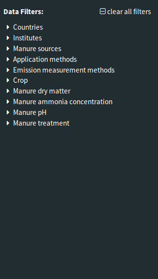
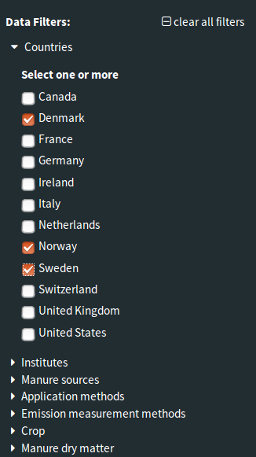
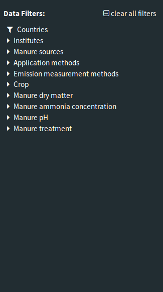




RStudio's Shiny package hit the CRAN repository in December of 2012, and it has proven to be completely amazing. Proven is a subjective term. Some would say shiny apps are not enterprise web solutions, but if apps made today last three years, won't that be roughly on par with the expected lifetime of other web technology?   
In any case, I make money by building apps for clients, and I'm sure lots of other folks do too, so let's look at a simple way to make 21st century menus in your shiny applications.

The issue is that shiny links to the Font-Awesome icon library and offers a function to add those icons to your app (`shiny::icon()`), but what you do with those icons beyond a static image is up to you. This icon library is ubiquitous across the web, and no doubt we are all aware of how they can signal to a user that you can click a menu to expand or collapse it. This is a low-key but critical piece of the user experience. We're going to do exactly that right here with a deep set of filters embedded within collapsible menus, as well as offer information about the state of the each filter while it is hidden.  

Here's the menu I have embedded in the sidebar of a "shinydashboard":  


I've initialized the menu links with a default icon "fa fa-caret-right", and a series of conditionalPanels that expand when the link is clicked. A typical way to do this would be to use the `shiny::actionLink()` function in the ui.R file:  


```r
actionLink(inputId="showcountries", label="Countries", icon("caret-right"))
```

This is easy R code to write, but because shiny won't let us add an id to the inline icon element referencing the icon directly with jquery is not possible. Sure, we could locate it with a few extra portions of jquery selection, but for the beginner (I'm a jquery beginner) I think it is easier to just write raw HTML and include an id for the icon:  


```r
HTML('
  <a id="showcountries" href="#" class="action-button" style="padding-left:1em;" width="100%">
    <i id="showcountriesicon" style="padding-right:0.5em;" class="fa fa-caret-right"></i>
    Countries
  </a>'
),
conditionalPanel('input.showcountries % 2 == 1',
  div(style='padding-left:1em', 
    checkboxGroupInput('countries', 'Select one or more', choices=NULL)
  )
)
```

And below the link is our `conditionalPanel()`, set to open on the odd-numbered clicks and to close on the even-numbered clicks. The icon says to the user "click to expand",  so we don't have to explicitly write that. What we also want is for the icon to change its message and say "click to collapse" when the `conditionalPanel()` is displayed, and as an added feature we'll set it to remind the user if they have filters applied in a hidden filter (the message is "you have filters set here"). These are valuable "non-verbal communication" features of the UI, and while shiny doesn't do it automagically they do provide an way for R to send messages to the javascript in the website with `session$sendCustomMessage()` function. We can use this to both call a javascript function as well as pass values to that function. The value we need is whether any of the boxes in this `checkboxGroupInput()` are selected. We could certainly get that information in javascript as well, but this is just as easy. Here is the observer placed in the server.R file:    


```r
# Toggle menu carets
observeEvent(
  eventExpr=input$showcountries, 
  handlerExpr=session$sendCustomMessage(
    type = 'togglecaret', 
    message = list(
      id='showcountriesicon', 
      val=!is.null(input$countries)
    )
  ),
  ignoreInit=TRUE
)
```

Now we need to write the `togglecaret` message handler and place it at `www/js/togglecaret.js` within the app directory. Here's what it looks like:

```
Shiny.addCustomMessageHandler("togglecaret",
  function(message) {
    var el = document.getElementById(message.id);
    if ($(el).hasClass('fa-caret-down')) {
        if (message.val) 
            $(el).removeClass('fa-caret-down').addClass('fa-filter');
        else 
            $(el).removeClass('fa-caret-down').addClass('fa-caret-right');
    }
    else 
    if ($(el).hasClass('fa-filter')) {
        $(el).removeClass('fa-filter').addClass('fa-caret-down');
    }
    else
    if ($(el).hasClass('fa-caret-right')) {
        $(el).removeClass('fa-caret-right').addClass('fa-caret-down');
    }
  }
);

```

Our logic here is simple; when called, change the icon to a new one. The new one might be caret-down if the icon is currently caret-right, or if the checkbox group has a value and the icon is currently caret-down change it to filter. If there is no value and the icon is caret-down change to caret-right. We could have rotated it instead of replacing it, but I'm not sure there is a functional difference.  

Here's how it looks when the link is clicked:  


And here's how it looks when the menu is collapsed and some boxes are checked:  


Pretty easy, and it is the little things that make the entire app more professional.  


