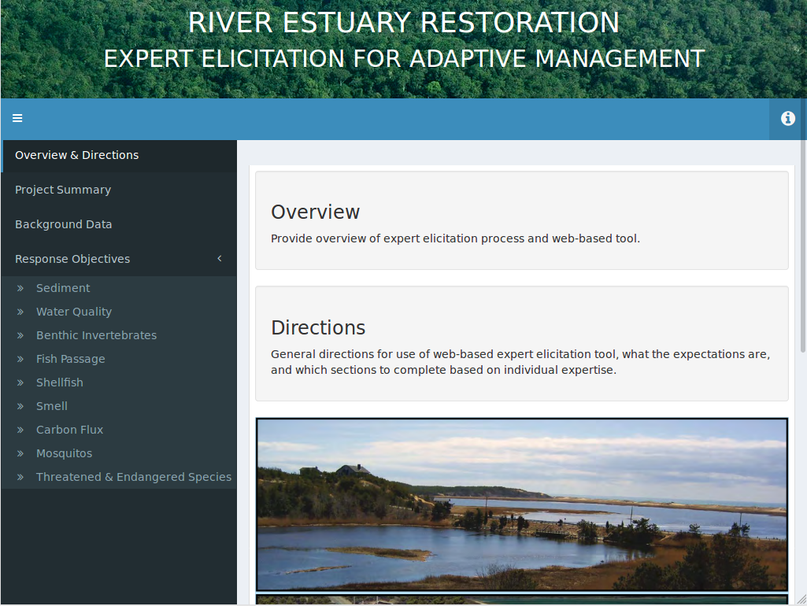
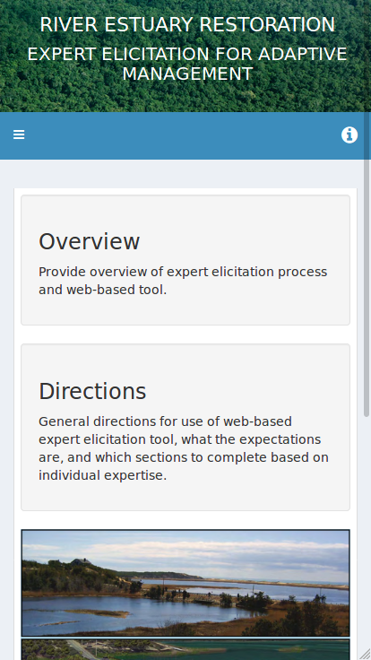



When someone asks me to make them a shiny application they often have a vague desire for it to have a header -- usually with a cluttering background image -- and something that looks like a [shinydashboard](https://CRAN.R-project.org/package=shinydashboard) underneath it. For better or worse, the [AdminLTE dashboard](https://adminlte.io/themes/AdminLTE/index2.html) upon which shinydashboard is built doesn't want to play along without some custom help. Click through that AdminLTE link to see some dashboard clutter...   

The AdminLTE framework has a place for a title in the upper left, which can be [exploited for a header image](https://github.com/rstudio/shinydashboard/issues/57). Once you set the image to full width, there are some hopps to jump through to move the navbar and sidebar elements below it. The first things that you'll try but won't work are to add this styling to your linked CSS file, and the second thing that you'll try but which also won't work is to add the CSS directly to your header.  

The reason these won't work is because the shinydashboard package adds some CSS directly to the body of the page to override some of the AdminLTE styling. When CSS rules conflict the last one loaded takes precedence ([assuming equal weight](http://css.maxdesign.com.au/selectutorial/advanced_conflict.htm)), so to override the package defaults we need to add ours below it using the same strategy.  

Here's what we want to create, view in Firefox responsive design mode at iPad Air resolution:  


Here is the same app, with the sidebar hidden:  


And here it is viewed at iPhone 6 Plus resolution, although I don't think anyone should fill out this survey on their phone:  


The CSS took some trial and error, and it is not perfect, but it should be good enough for now.  

### Adding the header image
I use the two-file system. In my ui.R file I make the header with `dashboardHeader()`, and I make it full width:

```r
shinyUI(
	dashboardPage(
        title = 'HRRC',
	    header = dashboardHeader(
	        titleWidth='100%',
	        title = span(
	            tags$img(src="img/canopyFull.jpg", width = '100%'), 
	            column(12, class="title-box", 
	                tags$h1(class="primary-title", style='margin-top:10px;', 'RIVER ESTUARY RESTORATION'), 
	                tags$h2(class="primary-subtitle", style='margin-top:10px;', 'EXPERT ELICITATION FOR ADAPTIVE MANAGEMENT')
                )
            ),
            dropdownMenuOutput("helpMenu")       
        ),
        body = dashboardBody(
            # see next chunk for the CSS
        )
    )
)
```

This CSS I add as the first argument in the dashboardBody() function:  

```css
tags$style(type="text/css", "
/*    Move everything below the header */
    .content-wrapper {
        margin-top: 50px;
    }
    .content {
        padding-top: 60px;
    }
/*    Format the title/subtitle text */
    .title-box {
        position: absolute;
        text-align: center;
        top: 50%;
        left: 50%;
        transform:translate(-50%, -50%);
    }
    @media (max-width: 590px) {
        .title-box {
            position: absolute;
            text-align: center;
            top: 10%;
            left: 10%;
            transform:translate(-5%, -5%);
        }
    }
    @media (max-width: 767px) {
        .primary-title {
            font-size: 1.1em;
        }
        .primary-subtitle {
            font-size: 1em;
        }
    }
/*    Make the image taller */
    .main-header .logo {
        height: 125px;
    }
/*    Override the default media-specific settings */
    @media (max-width: 5000px) {
        .main-header {
            padding: 0 0;
            position: relative;
        }
        .main-header .logo,
        .main-header .navbar {
            width: 100%;
            float: none;
        }
        .main-header .navbar {
            margin: 0;
        }
        .main-header .navbar-custom-menu {
            float: right;
        }
    }
/*    Move the sidebar down */
    .main-sidebar {
        position: absolute;
    }
    .left-side, .main-sidebar {
        padding-top: 175px;
    }"
)
```

