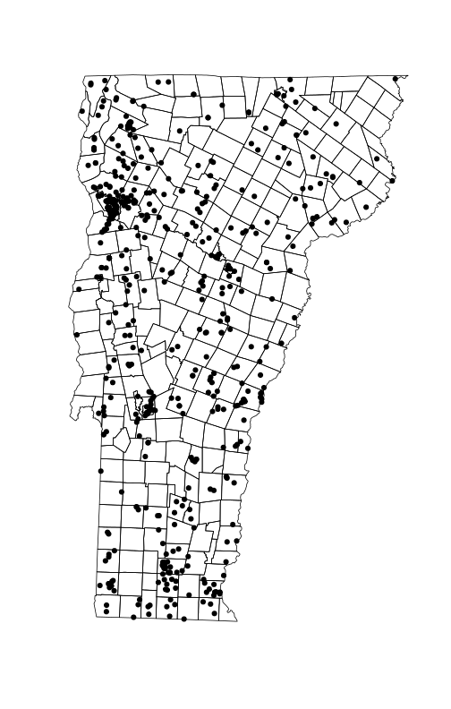
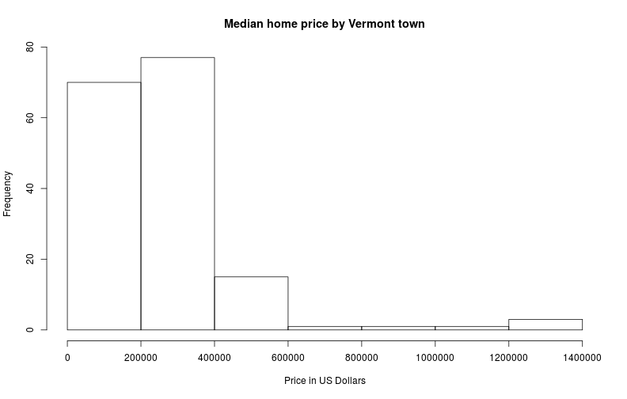
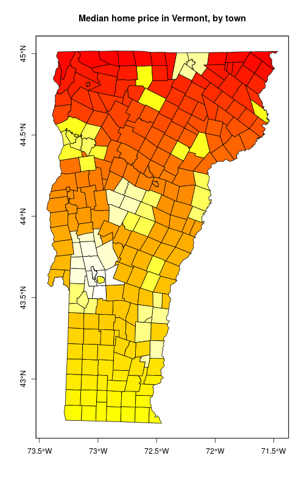
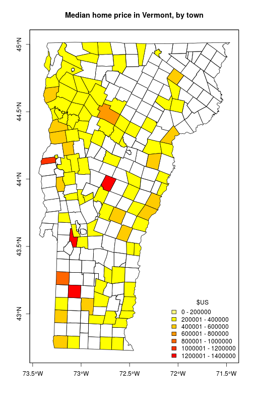
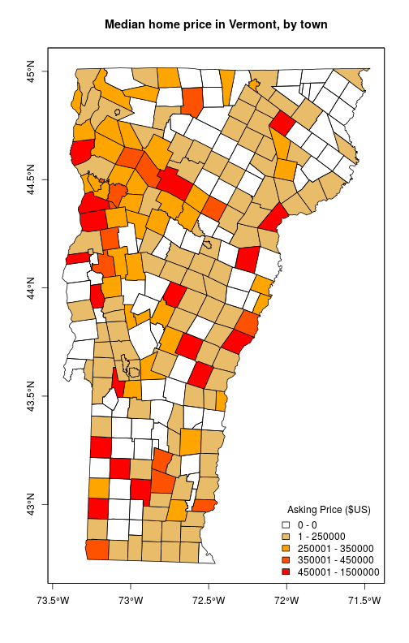
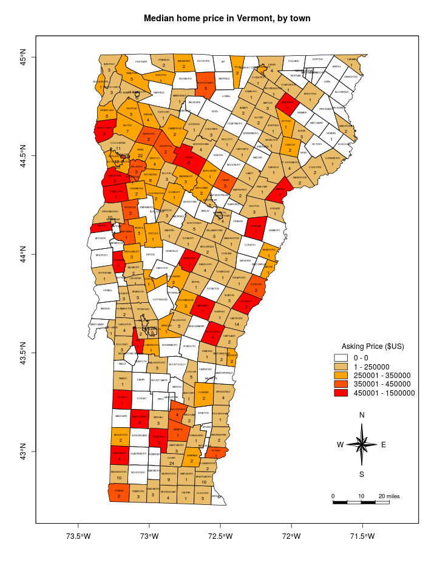



# Mapping with R's base graphics

There must be a half-dozen ways to make maps in R. Let's not conflate spatial analysis with making maps; there is typically only one - maybe two - ways to do any given spatial analysis. Reading and writing vector files: use package rgdal. Spatial analysis with vector files: use packages sp and rgeos. Use package raster (and occasionally gstat) to work with rasters.  

When it comes to plotting the output, you can take your pick of methods. If you are reading this post, you've probably already seen a few other more popular posts. I'll single out this one because I refer to it regularly, plus it links to many other excellent pages:  
[https://pakillo.github.io/R-GIS-tutorial/]()  

### Here are my feelings towards what I believe are the two most popular mapping methods.
  * **sp::spplot**  
     + Pros: Offers fine control for overlays for a professionally finished look.  
     + Cons: Uses lattice, which is an implementation of Trellis graphics for R. This is which basically a whole different plotting language--users familar with R base graphics will need to read many help files and do a lot of web searching to figure this out the first time. Complexity of the code increase dramatically with each new feature plotted including text overlays, scale bars, north arrows--and we haven't even added additional overlays. Each feature is a list of lists, possibly nested even deeper.  
  * **ggplot2**  
     + Pros: Offers fine control for overlays for a professionally finished look. Map has the smooth appearance of a ggplot.  
     + Cons: ggplot is the *grammar of graphics*, which is also a whole different plotting language. I'm not a ggplot user, although I agree the plots look fantastic.  

The handicap that both of these share is that neither plays well with R's base graphics. I might be in the minority on this one, but I happen to really like the austerity of plots produced by the base graphics. The trend-following part of me wants to learn ggplot because the plots are slick and colorful, but the swim-against-the-current part of me prefers a good old-fashioned black-and-white line graph.  

For mapping I am usually in a small hurry, so oftentimes I prefer to use the base graphics because they are so easy--read in a layer, then send the plot command, and be done.   
Let's run through a quick example.

### Getting help with plot methods
First off, finding help for S4 methods takes a little getting used to. What I need to re-learn every month or so is that the `methods` package extends functionality of the `'?'` function, so as you might get help for an S3 plot method with `?plot` or `?plot.data.frame`, you get help for an S4 method with something like `method?plot('SpatialPoints')`. A little more cumbersome, but a must know to get anything done with an S4 package.

### Quick choropleth mapping with base graphics
The general outline of tasks is:
  1. Get the homes for sale data.
  2. Aggregate the data by town.
  3. Plot the aggregated data.
  4. See what can be done to make ourselves more proud of the plot.

#### 1. Get the data
To keep this simple I'll just read in some data rather than finding it right now. Our sample data today will be the subject of a future post: homes for sale in Vermont, scraped from Zillow's website. I'll read in a snapshot of homes for sale on May 1, 2016.


```r
zdata <- read.csv('data/FS_2016May01.csv')
# Get a random preview of the table
zdata[sample(1:nrow(zdata), 20),]
```

```
##                z_id                                     address      lat
## 67  zpid_2098794934             92-E-Allen-St-Winooski-VT-05404 44.49134
## 453   zpid_81625101            190-Sand-Rd-Ferrisburgh-VT-05456 44.16929
## 47    zpid_92045327            575-Bullock-Dr-Guilford-VT-05301 42.79941
## 485 zpid_2098847498     0-Monument-Hill-Rd-Springfield-VT-05156 43.30723
## 93  zpid_2105461303  N-Ryder-Pond-Rd-LOT-42-Whitingham-VT-05361 42.81792
## 497   zpid_75479548            204-Kelly-Rd-Dummerston-VT-05301 42.90271
## 425  zpid_124480531        283-Hardscrabble-Rd-Bristol-VT-05443 44.15731
## 321   zpid_92290806      30-Logwood-Cir-Essex-Junction-VT-05452 44.48313
## 217   zpid_75449802                 69-East-St-Orleans-VT-05860 44.81125
## 337 zpid_2098828263          326-White-Brook-Rd-Sharon-VT-05065 43.79096
## 445 zpid_2131335491   0-Blockhouse-Point-Rd-North-Hero-VT-05474 44.84657
## 227 zpid_2099879528      127-Fannie-Hill-Rd-Wilmington-VT-05363 42.92525
## 455   zpid_81602541          809-Pierce-Hill-Rd-Sutton-VT-05867 44.67259
## 29  zpid_2114056422                      Rr-9-Marlboro-VT-05344 42.83715
## 322   zpid_92025557    1383-Clarendon-Ave-West-Rutland-VT-05777 43.57468
## 14    zpid_75470803 265-Wildflower-Ln-Waterbury-Center-VT-05677 44.39692
## 392 zpid_2126158245              918-Lovers-Ln-Chester-VT-05143 43.28086
## 410   zpid_92018773             60-Campbell-Rd-Rutland-VT-05701 43.58870
## 373   zpid_92247986       125-Chapin-Rd-Essex-Junction-VT-05452 44.53359
## 476 zpid_2105558409       145-Sherwood-Cir-Brattleboro-VT-05301 42.86230
##          long  price beds baths sqft        acres yr_built
## 67  -73.18277 670000  6.0     6 3800 1.523877e+09     1895
## 453 -73.27385 229000  0.5    NA 1721 2.300000e+00     1914
## 47  -72.61330 279000  2.0     1  967 1.060000e+01     2003
## 485 -72.47630  69900   NA    NA   NA 1.030000e+01       NA
## 93  -72.84584  25000   NA    NA   NA 2.630000e+00       NA
## 497 -72.65325 347500  3.0     3 2760 1.030000e+01     1970
## 425 -73.10438 287400  3.0     3 1664 2.150000e+00     2011
## 321 -73.05179 345000  3.0     3 2534 7.400000e-01     1985
## 217 -72.19647 224900  3.0     1 1700           NA       NA
## 337 -72.47788 229000  3.0     2 1656           NA     1982
## 445 -73.26604 100000   NA    NA   NA 3.820000e+01       NA
## 227 -72.89042 750000  4.0     3 2400           NA       NA
## 455 -72.01751 349500  4.0     2 2700 2.800000e+01     2005
## 29  -72.73828  50000   NA    NA   NA 1.650000e+01       NA
## 322 -73.03454 289900  4.0     3 2800 2.670000e+01     1992
## 14  -72.71788 490000  3.0     2 2995           NA       NA
## 392 -72.61479 500000  5.0     3 2710 7.700000e+01     1791
## 410 -72.99327 224900  3.0     3 2400 4.900000e-01     1991
## 373 -73.05778 395000  4.0     3 2300 3.900000e+00     2000
## 476 -72.62060 184000  3.0     2 1120 7.371903e+09     1997
```

Data scraped from a web page is bound to be missing a fair number of values, and that seems to be true here. As far as I can tell the `lat` and `long` fields are intact though.

I'm going to limit this post to vector data so I can keep the packages to a minimum. Now I can convert our zillow data to a Spatial object and read in a shapefile with Vermont town boundaries:


```r
library(rgdal)
library(sp)
library(raster) # for its summary print method

# Convert zillow data to a SpatialPointsDataFrame using the International Association 
# of Oil & Gas Producers EPSG code for WGS84 projection:
z.spat <- SpatialPointsDataFrame(zdata[,c('long', 'lat')], data=zdata, proj4string=CRS("+init=epsg:4326"))

# Read in town boundaries
vt.twn <- readOGR(dsn='data/Boundary_TWNBNDS', layer='Boundary_TWNBNDS_poly')
```

```
## OGR data source with driver: ESRI Shapefile 
## Source: "data/Boundary_TWNBNDS", layer: "Boundary_TWNBNDS_poly"
## with 255 features
## It has 5 fields
```

```r
vt.twn
```

```
## class       : SpatialPolygonsDataFrame 
## features    : 255 
## extent      : 424788.8, 581562, 25211.84, 279799  (xmin, xmax, ymin, ymax)
## coord. ref. : +proj=tmerc +lat_0=42.5 +lon_0=-72.5 +k=0.9999642857142857 +x_0=500000 +y_0=0 +datum=NAD83 +units=m +no_defs +ellps=GRS80 +towgs84=0,0,0 
## variables   : 5
## names       : FIPS6,  TOWNNAME, CNTY, SHAPE_area, SHAPE_len 
## min values  :  1005,   ADDISON,    1,  100122404, 10203.963 
## max values  :  9095, WORCESTER,    9,   99942616,  9386.921
```

```r
# transform town boundary projection to match the points
vt.twn <- spTransform(vt.twn, CRSobj=proj4string(z.spat))
```
To see how quickly the base graphics get us up and running with a visual, lets plot the points.

```r
plot(vt.twn)
plot(z.spat, add=TRUE, pch=19)
```

 

For a quick comparison, here's what the map looks like on it's home site:  
<div style='text-align:center;'>

</div>


#### 2. Aggregate the data by town.
Now that everything appears to be in order, I'd like to shade the map according to one or more of the attributes in the data. I'll begin with home median home price by town.


```r
# sp has a great spatial aggregation tool, no need to actually do any overlay
price <- aggregate(z.spat['price'], by=vt.twn['TOWNNAME'], FUN=median, na.rm=TRUE) 
price
```

```
## class       : SpatialPolygonsDataFrame 
## features    : 255 
## extent      : -73.4379, -71.46528, 42.72696, 45.01666  (xmin, xmax, ymin, ymax)
## coord. ref. : +init=epsg:4326 +proj=longlat +datum=WGS84 +no_defs +ellps=WGS84 +towgs84=0,0,0 
## variables   : 1
## names       :   price 
## min values  :   50000 
## max values  : 1395000
```

```r
# see what values price has
hist(price$price, main='Median home price by Vermont town', xlab='Price in US Dollars')
```

 
Judging from the histogram, most homes for sale in Vermont are asking less than $400,000, but more than one are asking more than $1.2M. This is going to make shading this map a little harder than I initially expected.  
I'll start with a simple linear shading scheme, using the built-in `heat.colors` function for the `col` argument.


```r
plot(price['price'], col=heat.colors(255), main='Median home price in Vermont, by town', axes=TRUE)
box()
```

 

OK, it is clear from the plot that the base plot method just colors towns based on plot order rather than on the underlying value in the attribute table. Maybe this is not as simple as I initially expected.  

I tested various options for a solid hour, and here's what I came up with. I can't change the plot order, but I can change the coloration. I need to rearrange the colors in `heat.colors()` and take them from a simple ramp to a vector arranged according to the median home price per town. The steps I'd like to perform are:
  1. Use the `hist` function to compute price bins.
  2. Assign the prices to bins.
  3. Use the assigned bins to rarrange the color vector.
  4. Plot the map.
  5. Return an invisible vector of bins to use in the legend.
  
I'm going to do this by defining a quick custom function. The "quick" part is that I'm not including any argument checking that would make a more finished function in a package. The following function will perform the above steps.

```r
choropleth <- function(
    sp,         # the feature to plot as an R object; any feature derived from package sp.
    attrib,     # the attribute name in the table; length 1 character vector.
    color.ramp=heat.colors,  # The color ramp to use. Can also use colorRampPalette().
    hist.args=NULL,  # Named list of additional arguments to hist(), excluding `plot`.
    ...         # Additional arguments to plot().
) {
    spa <- na.omit(sp[[attrib]])
    # Step 1
    ha <- list(x=spa, plot=FALSE)
    ha <- c(ha, hist.args)
    bins <- do.call(hist, ha)$breaks
    # Step 2
    bin <- rep(NA, length(spa))
    for(i in length(bins):1) bin[spa > 0 & spa <= bins[i]] <- i-1
    # Step 3
    sp$bin <- NA
    sp[['bin']][!is.na(sp[[attrib]])] <- bin
    customcolor <- rev(color.ramp(length(bins)-1))
    customcolor[1] <- "#FFFFFF"
    plot(sp, col=customcolor[sp$bin], ...)
    # Step 4
    low.bin <- bins + 1
    low.bin[1] <- 0
    oldopts <- options(scipen=100000)
    on.exit(options(oldopts))
    invisible(paste(low.bin[1:(length(low.bin)-1)], '-', bins[2:length(bins)]))
}
```

Now the first test. I'm going to put a legend on to see how it looks.

```r
x <- choropleth(price, 'price', main='Median home price in Vermont, by town', axes=TRUE)
legend('bottomright', legend=x, fill=rev(heat.colors(length(x))), bty='n', title='$US')
box()
```

 

This looks more-or-less OK, but I've plotted two yellows, two oranges, and three reds that I can't distinguish. I think I would be better off with a white, then some distinct colors. I will solve this with a one-two puch top improve my odds of success. First I'll set up my color ramp to transition between three colors. Second, since I'm using `hist()` to compute breaks, I can pass breaks into the above function manually. I want finely divided breaks between 1 and $450,000 and then one category for higher than $450,000.
 
 ```r
 fill.col <- colorRampPalette(c('red', 'orange', 'lightgray'))
 x <- choropleth(price, 'price', color.ramp=fill.col, hist.args=list(breaks=c(0, 0, seq(250000, 450000, by=100000), 1500000)), main='Median home price in Vermont, by town', axes=TRUE)
 fill <- rev(fill.col(length(x)))
 fill[1] <- 'white'
 legend('bottomright', legend=x, fill=fill, bty='n', title='Asking Price ($US)')
 box()
 ```
 
  

Now some finishing touches that I'll discuss more in a future post: a scale bar, a north arrow, larger fill-boxes in the legend, and labels for both town name and count of homes for sale.


```r
source('mapFunctions.R')
source("http://www.math.mcmaster.ca/bolker/R/misc/legendx.R")

fill.col <- colorRampPalette(c('red', 'orange', 'lightgray'))
x <- choropleth(price, 'price', color.ramp=fill.col, hist.args=list(breaks=c(0, 0, seq(250000, 450000, by=100000), 1500000)), main='Median home price in Vermont, by town', axes=TRUE)
fill <- rev(fill.col(length(x)))
fill[1] <- 'white'
legend('bottomright', legend=x, fill=fill, bty='n', title='Asking Price ($US)', box.cex=c(2, 0.8), inset=c(0, .25))
scalebarTanimura(loc='bottomright', length=0.3960193, inset=c(0.52, -0.75), mapunit='degrees', unit.lab="miles")
northarrowTanimura(loc='bottomright', size=0.4, inset=c(0,0), mapunit='degrees')
text(x=coordinates(vt.twn)[,1], y=coordinates(vt.twn)[,2], labels=vt.twn$TOWNNAME, pos=3, offset=0.3/2, cex=0.3)
count <- aggregate(z.spat['price'], by=vt.twn['TOWNNAME'], FUN=length) 
text(x=coordinates(vt.twn)[,1], y=coordinates(vt.twn)[,2], labels=count$price, pos=1, offset=0.6/2, cex=0.6)
box()
```

 


